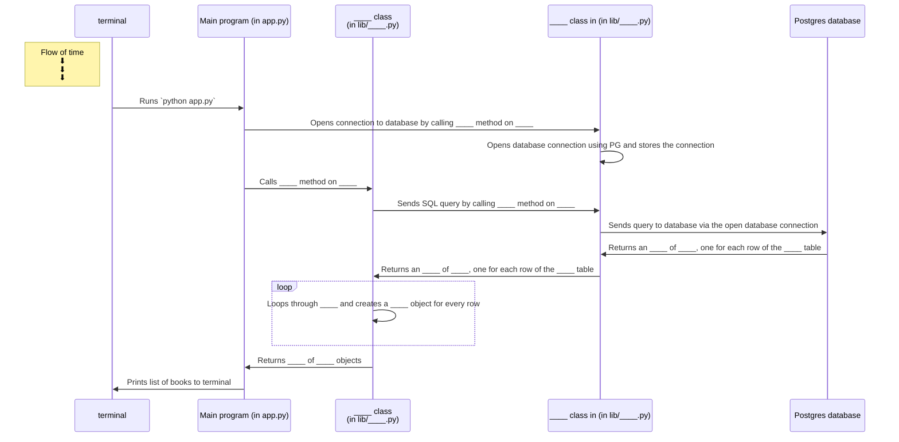

```mermaid
sequenceDiagram
    participant t as terminal
    participant app as Main program (in app.py)
    participant ar as ____ class <br /> (in lib/____.py)
    participant db_conn as ____ class in (in lib/____.py)
    participant db as Postgres database

    Note left of t: Flow of time <br />⬇ <br /> ⬇ <br /> ⬇ 

    t->>app: Runs `python app.py`
    app->>db_conn: Opens connection to database by calling ____ method on ____
    db_conn->>db_conn: Opens database connection using PG and stores the connection
    app->>ar: Calls ____ method on ____
    ar->>db_conn: Sends SQL query by calling ____ method on ____
    db_conn->>db: Sends query to database via the open database connection
    db->>db_conn: Returns an ____ of ____, one for each row of the ____ table

    db_conn->>ar: Returns an ____ of ____, one for each row of the ____ table
    loop 
        ar->>ar: Loops through ____ and creates a ____ object for every row
    end
    ar->>app: Returns ____ of ____ objects
    app->>t: Prints list of books to terminal
```